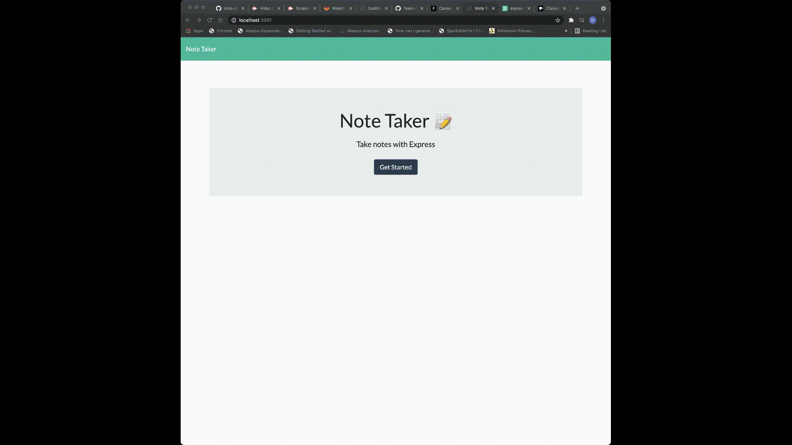

  # Note Taker App

  ## License Badge/Link
  N/A

  N/A
  ## Table of Contents
    * [Description](#Description)
    * [Installation](#Installation)
    * [Usage](#Usage)
    * [Contribution](#Contribution)
    * [Tests](#Tests)
    * [License](#License)

  ## Descritpion
  This app was created using Express.js to retrieve the data from a JSON file. Once the user creates a new note, they can save it, create a new note, and then later delete any of the older notes.

  ## Installation
  Node modules are required to install this app. Run ``npm install`` in the terminal to download the node modules.

  ## Usage
  In the terminal run ``node server.js`` to get the app to listen to the PORT. Once the app is live click on get started to add a new note. Notes can be saved and deleted.

    

  ## Contribution
  Rwan Abdelmonem

  ## Tests
  No tests were ran for this app.

  ## Questions

  Github URL:
  https://github.com/rabdelmonem0

  For any questions, I can be reached at:
  rabdelmonem0@gmail.com

  ## License
  N/A